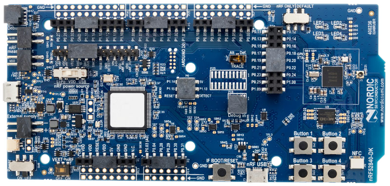
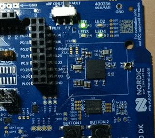

# Software Pulse-Width Modulation

This project was created during the Nordic Workshops 2023 in Kraków.

Tested on [nRF52840DK](https://www.nordicsemi.com/Products/Development-hardware/nrf52840-dk)



**Note**: if you want to use PWM and your board supports it, it will be much better to
use [hardware PWM](https://docs.zephyrproject.org/latest/hardware/peripherals/pwm.html).

## Description

[Pulse-Width Modulation](https://en.wikipedia.org/wiki/Pulse-width_modulation) is
a method of controlling the average power delivered by an electrical signal. The
average value of voltage (and current) fed to the load is controlled by switching
the supply between 0 and 100% at a rate faster than it takes the load to change
significantly.

After successful building you will be able to see smoothly blinking LEDs: `LED1` and `LED4`:



You can also control the brightness of `LED2` with `BTN1` and `BTN2`. It can be turned
off with `BTN3` and turned on with `BTN4`.

## Building

```bash
west build -b nrf52840dk_nrf52840
west flash
```

More about building you can find [here](https://docs.zephyrproject.org/latest/develop/west/build-flash-debug.html).

You can also use [nRF Connect for VSCode](https://marketplace.visualstudio.com/items?itemName=nordic-semiconductor.nrf-connect).
